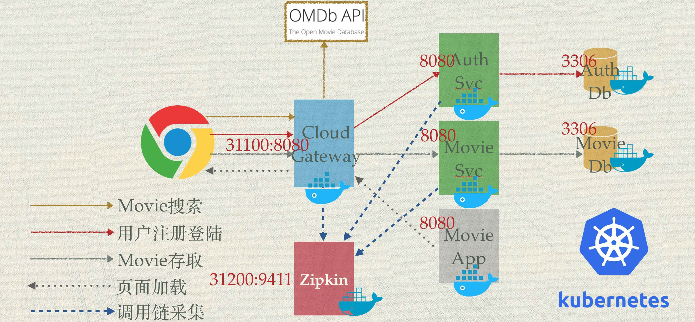
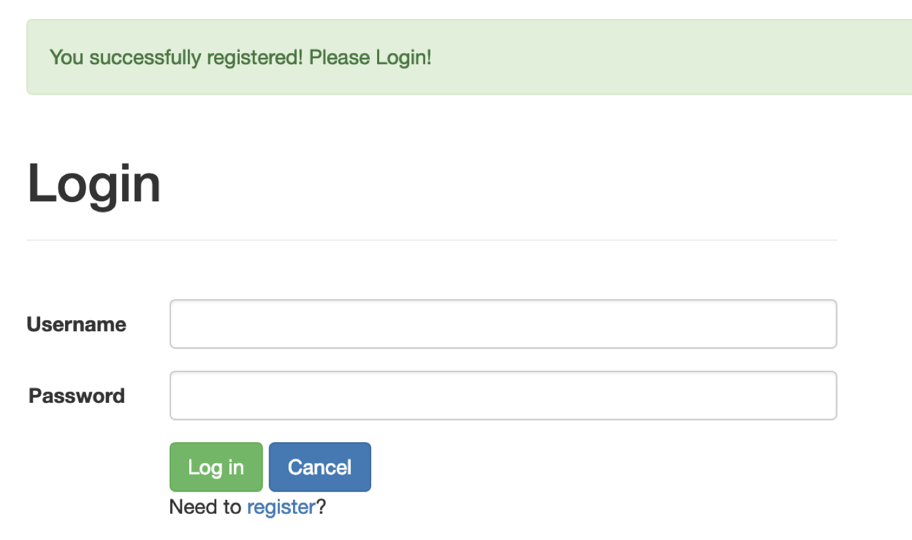
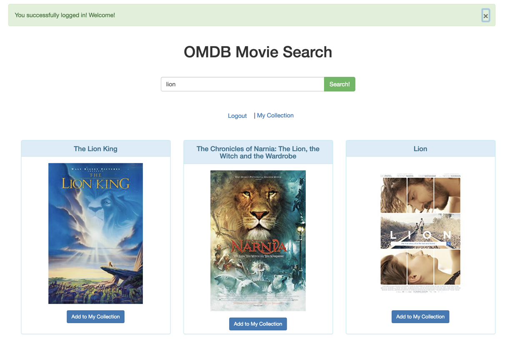
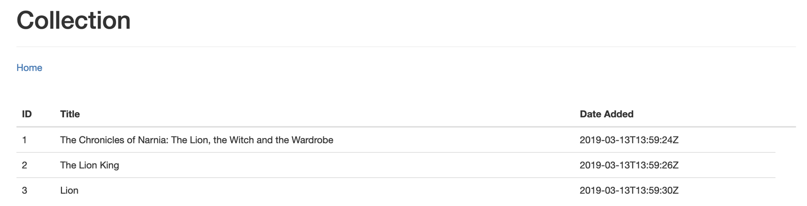
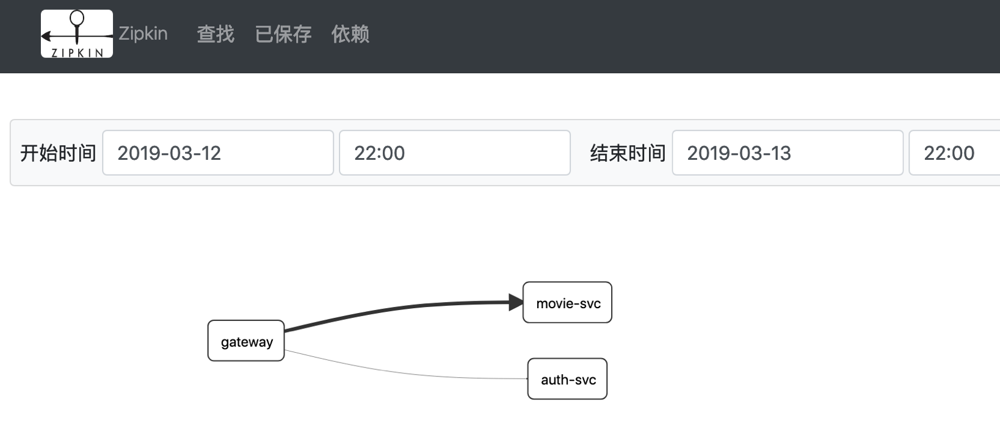

微服务和云原生架构实践～使用Spring Boot + JWT + React + Docker/Kubernetes
===

## 介绍

微服务(Microservices)和云原生(Cloud-Native)是近年技术热点，相关资料很多，但是缺乏端到端的集成案例，使得开发人员(甚至一些架构师)无法理解现代应用开发的全貌。本项目试图弥补这一不足，我将带领大家使用Spring Boot + JWT + React等主流技术，开发一个叫MovieApp的简单微服务应用，并且以云原生的方式，将应用一键部署到Kubernetes容器云中。

本项目帮助开发人员理解：

1. **全栈架构和DevOps**，传统意义上全栈(Full Stack)仅指同时会用前后端技术进行开发，但现代应用开发不仅包括前后端开发，还包括安全、测试、部署和监控等各个环节，如何让开发人员(尤其是新手)快速建立全栈和DevOps视角？
2. **微服务架构**，如何以微服务思想设计应用？开发微服务应用需要考虑哪些架构要素？如何用主流技术实现微服务架构？
3. **前后分离架构**，应用架构为什么要做前后分离？如何利用微服务网关实现前后分离架构？
4. **云原生架构**，什么是云原生架构？学习K8s需要掌握哪些核心概念？如何将微服务应用一键部署到K8s？

## 视频教程
大纲如下，具体内容请访问[我的CSDN学院](https://edu.csdn.net/course/detail/10687)

1. 课程大纲和项目架构
2. JWT简介
3. 安全设计(Spring Security + JWT)
4. AuthSvc代码剖析
5. AuthSvc演示
6. MovieSvc代码剖析
7. 前端代码剖析一
8. 前端代码剖析二
9. 网关代码剖析
10. 总体项目演示
11. Docker Compose部署文件剖析
12. 镜像构建和本地部署演示
13. K8s和云原生
14. K8s核心概念
15. K8s部署文件剖析
16. K8s部署演示和项目小结

## 架构

上图是整个应用的架构，比较简单，其中只有两个服务：

1. **AuthSvc**: 负责用户注册和登录，颁发JWT令牌等功能；
2. **MovieSvc**: Movie数据的存取服务，相当于演示应用的业务逻辑部分。对Movie数据的访问需要具有合法的JWT令牌，该服务也实现JWT令牌的自校验。

上面两个服务都是使用Spring Boot开发，数据分别存储在独立的**MySql**数据库中，相当于演示微服务独立数据源的思想。

MovieApp是应用前端，是由**React**开发的纯HTML/JS页面，MovieApp通过Ajax方式调用后台服务。

前后端之间有一个使用**Spring Cloud Gateway**开发的微服务网关，它是整个应用的单点入口，同时通过它实现应用的前后分离。

关于调用流程，上图红色箭头标注用户注册登录调用流，暗灰色箭头标注Movie存取调用流，虚线标注页面加载流。页面加载发生在浏览器第一次请求页面时，之后MovieApp就住在浏览器中，通过Gateway间接和后台API进行交互存取数据。

另外，应用使用一个叫OMDb(Open Movie Database) API的服务进行Movie查询，这个查询是浏览器中的MovieApp通过Ajax直接发起，架构图中使用暗黄色箭头标注调用流。

## 技术栈

本项目使用的技术栈包括：

1. Spring Boot ～ 后端开发框架，架构中的AuthSvc/MovieSvc/Spring Cloud Gateway服务使用Spring Boot开发。
2. Spring Security ~ 后端安全框架，通过Spring Security+JWT的方式实现微服务安全。
3. JWT ~ 令牌的生成和校验组件，实现无状态令牌校验。
4. MyBatis ~ ORM框架
5. MySQL ~ 后端存储，存放用户和Movie数据
6. React ~ 前端组件框架，所有MovieApp的页面基于React/JS开发。
7. Spring Cloud Gateway ～ 微服务网关，对API和静态页面进行反向代理，实现应用/API统一入口，实现前后分离架构。
8. Docker Compose ~ 镜像构建和本地部署，通过Docker Compose一键构建微服务镜像，实现本地一键部署，方便本地集成测试。
9. Kubernetes ~ 容器调度和部署，实现微服务应用一键部署，微服务应用全生命周期管理。

## 截图

### 1. 注册登录页面

### 2. Movie搜索页面

### 3. 我的收藏页面

### 4. Zipkin调用链监控

## 源码目录

本项目代码开源在github上，地址: https://github.com/jskillcloud/MovieApp

* /auth-svc/ : 用户注册认证服务，Spring Boot + Maven项目
* /gateway/ : 网关服务，Spring Boot + Maven项目
* /k8s/testing/ : k8s部署文件for测试环境
* /movie-app/ : 前端React项目
* /movie-svc/ : Movie存取服务，Spring Boot + Maven项目
* /docker-compose.yml : 本地docker compose镜像构建和部署文件

Review源码时，Spring Boot应用建议可使用IntellJ IDEA打开，React应用建议可使用VS Code打开，MySQL数据库可使用MySQLWorkbench查看。

## 更多文档

请关注我在CSDN上的[博客](https://blog.csdn.net/yang75108)

